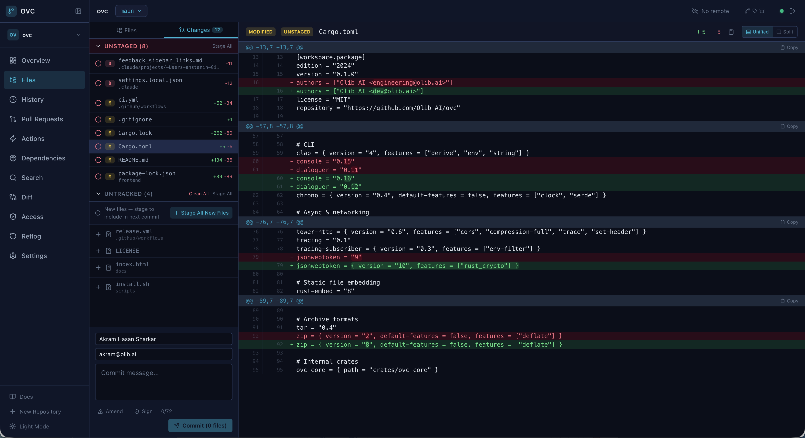
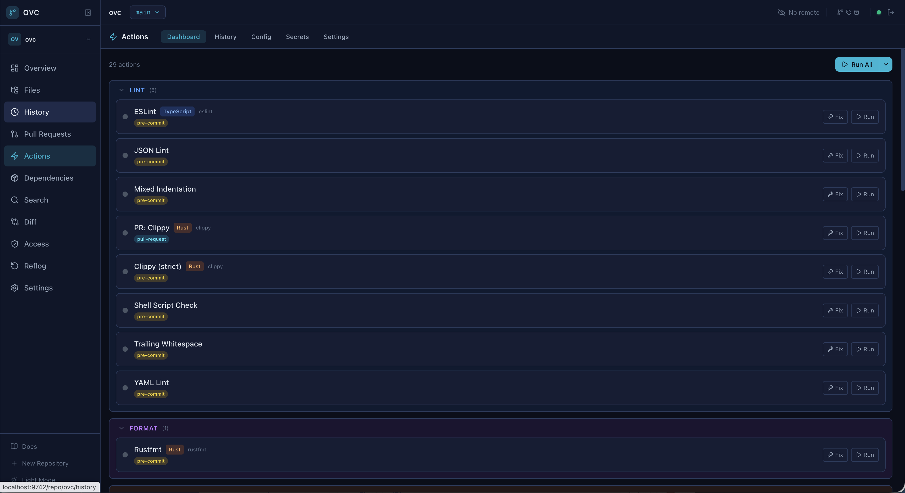
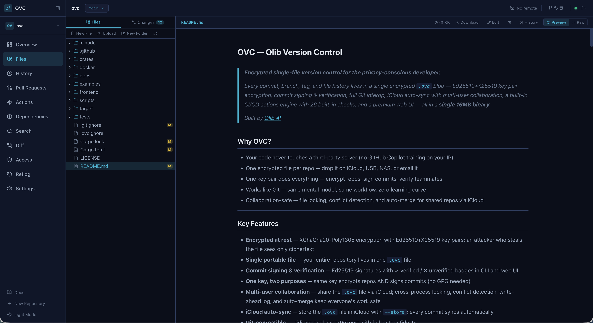
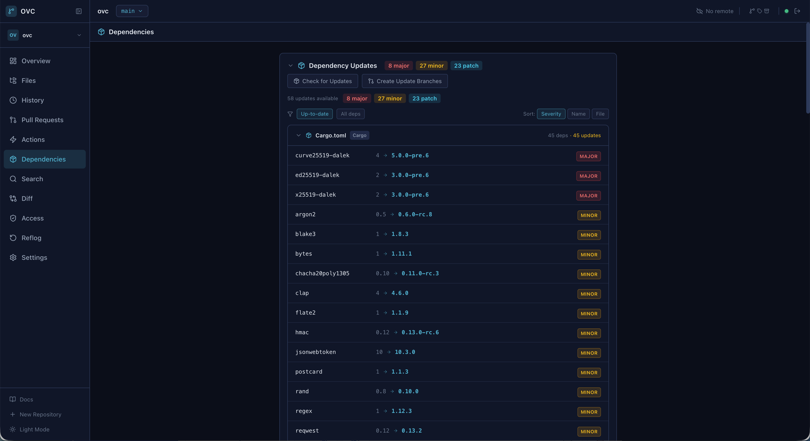

<p align="center">
  
</p>
<h1 align="center">OVC — Olib Version Control</h1>
<p align="center">
  <strong>Secure, self-hosted version control — encrypted single-file repositories you can store anywhere.</strong>
</p>
<p align="center">
  Every commit, branch, tag, and file history lives in a single encrypted <code>.ovc</code> blob — Ed25519+X25519 key pair encryption, commit signing & verification, full Git interop, cloud sync via any storage provider, a built-in CI/CD actions engine with 28 built-in checks, and a premium web UI — all in a <strong>single 22 MB binary</strong>.
</p>
<p align="center">
  Built by <a href="https://www.olib.ai">Olib AI</a>
</p>

---

## Why OVC?

Modern teams need version control they fully own — without giving up the convenience of cloud infrastructure.

- **Self-hosted, zero trust** — your code never touches a server you don't control; store encrypted repos on any cloud (iCloud, GCS, S3, Dropbox, NAS) while retaining full ownership
- **Encrypted at rest and in transit** — one encrypted file per repo; an attacker who intercepts the file sees only ciphertext
- **One key pair does everything** — encrypt repos, sign commits, verify teammates — no GPG needed
- **Works like Git** — same mental model, same workflow, zero learning curve
- **Collaboration-safe** — file locking, conflict detection, and auto-merge for shared repos via any cloud storage

---

## Key Features

- **Encrypted at rest** — XChaCha20-Poly1305 encryption with Ed25519+X25519 key pairs
- **Single portable file** — your entire repository lives in one `.ovc` file; store it on iCloud, GCS, S3, Dropbox, USB, NAS, or email it
- **Commit signing & verification** — Ed25519 signatures with verified / unverified badges in CLI and web UI
- **One key, two purposes** — same key encrypts repos AND signs commits (no GPG needed)
- **Multi-user collaboration** — share the `.ovc` file via any cloud storage; cross-process locking, conflict detection, write-ahead log, and auto-merge keep everyone's work safe
- **Cloud sync** — content-defined chunking via FastCDC; only changed parts transfer; supports local, GCS, and extensible backends
- **Git-compatible** — bidirectional import/export with full history fidelity
- **Built-in Actions Engine** — 28 built-in checks + custom shell commands, parallel execution with DAG dependencies, matrix strategy, secrets vault, retry logic
- **Premium web UI** — commit graph with SVG lanes, split diff viewer, blame view, code search, command palette, commit actions, toast notifications
- **Single binary** — VCS + crypto + git bridge + cloud sync + actions engine + web server + React UI
- **Access control (RBAC)** — per-user roles (read, write, admin, owner) with branch protection
- **Memory-safe** — `unsafe_code = "forbid"` workspace-wide; keys zeroed on drop via `zeroize`
- **Security-hardened** — constant-time auth, secret zeroization, path traversal protection, bounded resource allocation

---

## Quick Start

### Install

**Linux & macOS:**

```bash
curl -fsSL https://raw.githubusercontent.com/Olib-AI/ovc/main/scripts/install.sh | bash
```

**Windows (PowerShell):**

```powershell
irm https://raw.githubusercontent.com/Olib-AI/ovc/main/scripts/install.ps1 | iex
```

**Installer options:**

| Option | Description |
|--------|-------------|
| `--version VERSION` | Install a specific version (default: latest) |
| `--update` | Update binary only, preserve keys and config |
| `--uninstall` | Remove OVC completely |
| `--help` | Show help message |

**From source:**

```bash
git clone https://github.com/Olib-AI/ovc.git
cd ovc
cd frontend && npm install && npm run build && cd ..
cargo build --release
sudo cp target/release/ovc /usr/local/bin/ovc
```

> **macOS note:** If you see `zsh: killed` when running `ovc`, macOS Gatekeeper is blocking the unsigned binary. Run `sudo xattr -cr /usr/local/bin/ovc && sudo codesign --force --sign - /usr/local/bin/ovc` to ad-hoc sign it.

### Generate your key pair

```bash
ovc key generate --name mykey --identity "Your Name <you@email.com>"
```

Keys are stored in `~/.ssh/ovc/`. Back them up in your password manager:

```bash
ovc key export mykey
# Copy the output into a Bitwarden/1Password secure note
```

### Set up your environment

Add to `~/.zshrc` (or `~/.bashrc`):

```bash
export OVC_KEY=mykey
export OVC_KEY_PASSPHRASE=<your-key-passphrase>
export OVC_AUTHOR_NAME="Your Name"
export OVC_AUTHOR_EMAIL="you@email.com"
export OVC_SIGN_COMMITS=true   # auto-sign every commit
```

### Create your first repo

```bash
# Basic — .ovc file in current directory
ovc init --name my-project.ovc --key mykey

# With cloud sync — .ovc file on iCloud, code stays local
ovc init --name my-project.ovc --key mykey \
  --store ~/Library/Mobile\ Documents/com~apple~CloudDocs/ovc-repos/
```

### Daily workflow

```bash
ovc add .                              # Stage all files
ovc commit -m "add feature X"         # Commit (auto-signed if OVC_SIGN_COMMITS=true)
ovc commit --amend -m "better msg"    # Amend the last commit

ovc status                             # Working tree status
ovc log --oneline --graph             # Commit history with branch graph
ovc log --show-signatures              # Show verified / unverified
ovc diff                               # View changes
ovc diff --staged                      # View staged changes
ovc diff --stat                        # Summary of changes
ovc diff main..feature-x              # Diff between branches

ovc branch feature-x                   # Create branch
ovc checkout feature-x                 # Switch branch
ovc merge feature-x                    # Merge into current
ovc rebase main                        # Rebase onto main
ovc cherry-pick abc123                 # Cherry-pick (short hashes work)
ovc revert abc123                      # Revert a commit
ovc stash push -m "WIP"              # Stash changes
ovc stash pop                          # Restore stash

ovc checkout -- src/file.rs           # Restore a single file from HEAD
ovc reset -- src/file.rs              # Unstage a single file
ovc reset --hard HEAD~1               # Hard reset to previous commit
ovc clean -f                           # Remove untracked files
```

### Code investigation

```bash
ovc blame src/main.rs                  # Line-by-line authorship
ovc blame -L 10,20 src/main.rs        # Blame specific line range
ovc grep "TODO"                        # Search across all files
ovc grep -i "error" --count           # Case-insensitive with counts
ovc show HEAD~2                        # Show commit details + diff
ovc describe                           # Nearest tag + commit count
ovc shortlog -s -n                     # Commits per author
ovc reflog                             # Reference update history
ovc ls-files --staged                  # List tracked files
ovc notes add -m "reviewed"           # Add note to commit
ovc archive -o release.tar            # Export tree as tar/zip
```

### Multi-user access

```bash
# Share your public key with a teammate
cat ~/.ssh/ovc/mykey.pub               # Send this to them

# Add their public key to your repo
ovc key add teammate.pub

# They can now decrypt and work with the repo using their key
# List who has access
ovc key authorized
```

### Per-user access control (RBAC)

```bash
# Grant access with a specific role (read, write, admin, owner)
ovc access grant teammate.pub --role write

# List who has access and their roles
ovc access list

# Change a user's role
ovc access set-role SHA256:abc123... --role admin

# Revoke access
ovc access revoke SHA256:abc123...

# Protect a branch (require reviews + CI before merge)
ovc branch-protect main --required-approvals 2 --require-ci

# Remove branch protection
ovc branch-protect main --remove
```

Roles (ascending privilege):
- **read** — clone, view content, comment on PRs
- **write** — commit, push, create PRs and branches
- **admin** — manage branches, merge PRs, configure actions
- **owner** — full control including access management

### Pull request reviews

PRs support reviews and inline comments from multiple users:

```bash
# Reviews and comments are managed via the REST API:
# POST /api/v1/repos/:id/pulls/by-number/:number/reviews
# POST /api/v1/repos/:id/pulls/by-number/:number/comments

# Review states: approved, changes_requested, commented
# Branch protection can require N approvals before merge
```

### Collaboration (cloud storage)

```bash
# Each user works on their own branch
ovc checkout -b my-feature
ovc add . && ovc commit -m "my changes"

# If someone else saved while you were working, auto-merge happens:
# OVC detects the conflict, re-reads the remote state, imports their
# branches/objects, and saves the combined result — no data loss.

# Explicit sync with remote changes:
ovc sync
```

### Cloud sync (remote backends)

```bash
# Add a remote (local filesystem, GCS, or extensible backends)
ovc remote add origin /mnt/nas/repos/my-project --backend local
ovc remote add gcs-backup gs://my-bucket/repos --backend gcs

# Push/pull — only changed chunks transfer (FastCDC)
ovc push
ovc pull

# List and manage remotes
ovc remote list
ovc remote remove gcs-backup
```

### Web UI

```bash
ovc serve --port 9742                  # Start the server
ovc web                                # Open UI in browser (alias: ovc ui, ovc gui)
```

Features: commit graph with SVG lanes, split/unified diff viewer, blame view, code search, branch/tag management, commit actions (cherry-pick, create branch, tag from any commit), stash panel, actions dashboard, command palette, toast notifications, dark theme.

---

## Environment Variables

| Variable | Purpose |
|---|---|
| `OVC_KEY` | Default key name (stored in `~/.ssh/ovc/`) |
| `OVC_KEY_PASSPHRASE` | Key passphrase (or omit for interactive prompt) |
| `OVC_SIGN_COMMITS` | Set to `true` to auto-sign all commits |
| `OVC_AUTHOR_NAME` | Default commit author name |
| `OVC_AUTHOR_EMAIL` | Default commit author email |
| `OVC_PASSWORD` | Repository password (for password-based repos) |
| `OVC_PORT` | API server port (default: 9742) |
| `OVC_REPOS_DIR` | API server repos directory |
| `OVC_CORS_ORIGINS` | Allowed CORS origins for API |
| `OVC_WORKDIR_MAP` | Map repo IDs to working directories for the API server |

---

## CLI Reference

### Repository

| Command | Description |
|---|---|
| `init` | Create a new encrypted repository (`--key`, `--store`, `--name`) |
| `add <paths...>` | Stage files (`--all`, `--force`) |
| `commit -m <msg>` | Commit staged changes (`--sign`, `--amend`, `--no-verify`) |
| `status` | Working tree status (`--short`) |
| `log` | Commit history (`--oneline`, `--graph`, `--show-signatures`, `-n N`) |
| `diff` | Show changes (`--staged`, `--stat`, `--name-only`, `branch-a..branch-b`) |
| `show [commit]` | Display commit details and diff |

### Branching & History

| Command | Description |
|---|---|
| `branch [name]` | List, create, or delete (`-d`, `-D` force) branches |
| `checkout <target>` | Switch branches (`-b` to create, `-- <files>` to restore) |
| `merge <branch>` | Three-way merge into current branch |
| `rebase <onto>` | Rebase current branch onto target |
| `cherry-pick <commit>` | Apply a single commit onto HEAD (short hashes supported) |
| `revert <commit>` | Create a new commit undoing a previous commit's changes |
| `tag [name]` | Create, list, or delete (`-d`) tags |
| `stash` | `push`, `pop`, `apply`, `drop`, `list`, `clear` |
| `reset [commit]` | Reset HEAD (`--soft`, `--mixed`, `--hard`, `-- <files>` to unstage) |
| `clean` | Remove untracked files (`-n` dry run, `-f` force) |

### Code Investigation

| Command | Description |
|---|---|
| `blame <file>` | Line-by-line authorship (`-L start,end` for ranges) |
| `grep <pattern>` | Search file contents (`-i`, `--count`) |
| `describe [commit]` | Find nearest tag ancestor |
| `shortlog` | Commits grouped by author (`-s` summary, `-n` sort) |
| `reflog` | Show reference update history |
| `ls-files` | List tracked files (`--staged`, `--modified`, `--untracked`) |
| `notes` | `add`, `show`, `remove` — commit annotations |
| `archive` | Export tree as tar or zip (`--format`, `-o`) |
| `bisect` | Binary search for a bug-introducing commit |

### Key Management

| Command | Description |
|---|---|
| `key generate` | Generate Ed25519+X25519 key pair (`--name`, `--identity`) |
| `key list` | List keys in `~/.ssh/ovc/` |
| `key export <name>` | Export for Bitwarden/1Password |
| `key import <file>` | Import from password manager export |
| `key add <pubkey>` | Grant a public key access to the repo |
| `key remove <fingerprint>` | Revoke access |
| `key authorized` | List authorized keys for this repo |
| `verify [commit]` | Verify a commit's Ed25519 signature |

### Access Control

| Command | Description |
|---|---|
| `access list` | List users with access and their roles |
| `access grant <key> --role <role>` | Grant access with a role (`read`, `write`, `admin`, `owner`) |
| `access revoke <fingerprint>` | Revoke a user's access |
| `access set-role <fingerprint> --role <role>` | Change a user's role |
| `branch-protect <branch>` | Set branch protection (`--required-approvals N`, `--require-ci`) |
| `branch-protect <branch> --remove` | Remove branch protection |

### Cloud & Sync

| Command | Description |
|---|---|
| `remote add <name> <url>` | Add remote (`--backend local\|gcs`) |
| `remote list` | List configured remotes |
| `remote remove <name>` | Remove a remote |
| `push` | Push to remote |
| `pull` | Pull from remote |
| `sync` | Merge remote changes and save (for cloud collaboration) |
| `sync-status` | Show sync status |

### Actions (CI/CD)

| Command | Description |
|---|---|
| `actions init` | Auto-detect languages, generate `.ovc/actions.yml` |
| `actions list` | List configured actions |
| `actions run [names...]` | Run actions (`--trigger`, `--fix`) |
| `actions history` | View run history |
| `actions detect` | Detect project languages |
| `actions secrets` | `list`, `set <name> <value>`, `remove <name>` — manage secrets vault |

### Utilities

| Command | Description |
|---|---|
| `git-import <path>` | Import a Git repository into OVC |
| `git-export <file>` | Export an OVC repository to Git |
| `gc` | Garbage collect unreachable objects |
| `submodule` | `add`, `status`, `update`, `remove` — nested repositories |
| `web` / `ui` / `gui` | Open the web UI in your browser |
| `serve` | Start API server + web UI (`--port`, `--bind`, `--repos-dir`) |
| `daemon` | Manage background server (`install`, `uninstall`, `start`, `stop`) |
| `onboard` | Interactive setup wizard for new users |

---

## Actions Engine

Built-in CI/CD with 28 checks that require no external tools, plus support for any shell command:

```bash
ovc actions init              # Auto-detect languages, generate config
ovc actions run --trigger pre-commit  # Run all pre-commit actions
ovc commit -m "message"       # Pre-commit hooks run automatically
ovc commit --no-verify -m "skip"      # Bypass hooks
```

### Built-in actions (no external tools needed)

| Action | What it checks |
|--------|---------------|
| `secret_scan` | AWS keys, GitHub tokens, private keys, API keys |
| `supply_chain_scan` | ENV access, system file reads, process execution, network calls |
| `package_scan` | Obfuscated code, encoded payloads, suspicious network calls in dependencies |
| `trailing_whitespace` | Trailing spaces/tabs |
| `line_endings` | Consistent LF or CRLF |
| `file_size` | Files exceeding max size |
| `todo_counter` | TODO/FIXME/HACK occurrences |
| `license_header` | Required copyright header |
| `dependency_audit` | Typosquatting and wildcard versions in manifests |
| `code_complexity` | Excessive nesting depth |
| `dead_code` | Unreferenced functions |
| `duplicate_code` | Duplicate code blocks |
| `commit_message_lint` | Subject length, conventional commit format |
| `encoding_check` | UTF-8 validity |
| `merge_conflict_check` | Unresolved conflict markers |
| `symlink_check` | Broken symlinks |
| `large_diff_warning` | Oversized changesets |
| `branch_naming` | Branch name pattern validation |
| `debug_statements` | `console.log`, `println!`, `dbg!`, etc. |
| `mixed_indentation` | Tabs vs spaces mixing |
| `bom_check` | UTF-8 BOM detection |
| `shell_check` | Shell script best practices |
| `yaml_lint` | YAML syntax validation |
| `json_lint` | JSON syntax validation |
| `xml_lint` | XML well-formedness |
| `hardcoded_ip` | Hardcoded IP addresses |
| `non_ascii_check` | Non-ASCII characters in source |
| `eof_newline` | Files ending with newline |

### Engine features

- **Parallel execution** — independent actions run concurrently via DAG-based scheduling
- **Matrix strategy** — parameterized runs across variable combinations
- **Retry logic** — configurable retry attempts with delay
- **Secrets vault** — encrypted secrets injected as `OVC_SECRET_*` env vars
- **Output capture** — regex-based variable extraction from action output
- **Dependency ordering** — actions can depend on other actions
- **Path conditions** — glob-based filtering for changed files
- **Fix commands** — auto-remediation via `--fix` flag

### Docker execution

Actions can run inside a Docker container instead of on the host, eliminating the need to install language toolchains locally:

```yaml
# .ovc/actions.yml
defaults:
  docker:
    enabled: true
    image: ghcr.io/olib-ai/ovc-actions:latest
    pull_policy: if-not-present   # always | if-not-present | never

actions:
  rust-check:
    command: cargo check --workspace
    docker_override: false  # force native for this action
```

The `ovc-actions` image includes: Rust, Go, Node.js, Python, Ruby, Java, C/C++, Kotlin, C#/.NET, Deno, Dart, Swift, PHP, and Elixir.

Built-in actions (secret scan, whitespace, etc.) always run natively — only shell command actions use Docker. If Docker is unavailable, actions fall back to native execution with a warning.

### Auto-detected languages

Rust, JavaScript, TypeScript, Go, Python, Ruby, Java, C++, Kotlin, Swift, Dart/Flutter, C#, Deno, PHP, Elixir, Docker, Make

Configure in `.ovc/actions.yml`. See `ovc actions init` to get started.

---

## Collaboration Safety

OVC is designed for safe multi-user collaboration via shared storage (iCloud, GCS, S3, Dropbox, NAS):

- **Cross-process file locking** — advisory locks prevent concurrent writes; stale locks from crashed processes or remote hosts are automatically detected and cleaned
- **Conflict detection** — file sequence validation detects if another user modified the repo since you opened it
- **Write-ahead log** — crash recovery journal prevents data loss from interrupted saves; orphaned temp files are cleaned up on next open
- **Auto-merge** — when a conflict is detected during save, OVC automatically re-reads the remote state, imports new branches/objects, and saves the combined result
- **Branch-based workflow** — each user works on their own branch; the auto-merge preserves all branches without logical conflicts

---

## Security Model

### One key, two purposes

Your OVC key pair (`~/.ssh/ovc/mykey.key`) contains:
- **Ed25519** — signs commits (identity verification)
- **X25519** — encrypts repo data (derived via standard SHA-512 conversion)

No GPG. No separate signing key. No web of trust. The repo's authorized key list IS the trust anchor.

### Encryption flow

```
Your Key Pair (Ed25519 + X25519)
   |
   |--- X25519 ECDH with ephemeral key
   |         |
   |         +--- HKDF-SHA256 -> Sealed Key Encryption Key
   |
   +--- Segment Encryption Key (256-bit)
           |
           +--- XChaCha20-Poly1305 encrypts all data (192-bit nonce per segment)
```

### Security hardening

- Constant-time authentication (no timing side-channels)
- Secrets zeroed on drop via `Zeroizing<T>` wrappers
- HKDF-SHA256 for key derivation (not raw hashing)
- Bounded resource allocation (pipe reads, grep results, matrix combos, key slots, reflog, notes)
- Path traversal protection on all file operations
- Input validation at both API and core layers (ref names, commit messages, bucket names)
- Atomic WAL writes for crash recovery integrity
- Randomized temp file names (symlink attack prevention)
- API error sanitization (no internal path leakage)
- GCS bucket name validation
- Request body size limits (16 MiB)

### What an attacker sees in a `.ovc` file

Only the 64-byte header (magic bytes, KDF parameters, salt) and 32-byte trailer (offsets, HMAC) are plaintext. Everything else — file names, sizes, commit messages, authors, branch names, tags — is ciphertext.

---

## Web UI

```bash
ovc serve --port 9742
ovc web                    # Opens browser automatically
```

The web UI is embedded in the binary — no Node.js required in production.

| Staged Changes & Diff Viewer | Actions Dashboard |
|:---:|:---:|
|  |  |

| File Manager | Dependency Updates |
|:---:|:---:|
|  |  |

**Features:**
- Commit graph with SVG branch lanes and colored edges
- Split and unified diff viewer with line numbers
- Blame view with line-by-line authorship and commit coloring
- Code search across all tracked files
- Commit action bar — cherry-pick, create branch, tag, copy hash from any commit
- Right-click context menu on commits
- Command palette for quick actions
- Branch/tag/stash management panels with action buttons
- Staged changes with click-to-diff
- Commit form with author pre-fill
- Actions dashboard with run history and clear button
- Dependency updates dashboard
- Reflog viewer
- Toast notifications for all operations
- Dark theme with cyan accents
- Keyboard shortcuts

---

## Architecture

```
crates/
  ovc-core/       Core library — object model, crypto, storage, merge, diff, RBAC
  ovc-git/        Git interoperability — bidirectional import/export
  ovc-cloud/      Cloud sync — FastCDC chunking, storage backends (local, GCS)
  ovc-api/        REST API server — Axum-based, embedded React UI
  ovc-actions/    Actions/CI engine — 28 built-in checks, DAG scheduler, Docker
  ovc-cli/        CLI — 47 commands, Clap-based
  ovc-remote-helper/  Git remote helper (stub for future git clone ovc:// support)

frontend/         React 19 + TypeScript + Tailwind CSS + Vite (embedded into binary)
docker/           Docker image for actions execution
```

---

## Building from Source

### Prerequisites
- Rust 1.85+ (edition 2024)
- Node.js 20+ (for frontend build only)

```bash
# Build frontend (embedded into the binary)
cd frontend && npm install && npm run build && cd ..

# Build the binary
cargo build --release

# Install
sudo cp target/release/ovc /usr/local/bin/ovc

# Run tests
cargo test --workspace    # 200+ tests

# Lint
cargo clippy --workspace  # strict: all + pedantic + nursery
```

---

## Deployment

### Supported platforms

| OS | Architecture | Binary |
|----|-------------|--------|
| Linux | x86_64 | `ovc-linux-amd64` |
| Linux | aarch64 | `ovc-linux-arm64` |
| macOS | Intel | `ovc-darwin-amd64` |
| macOS | Apple Silicon | `ovc-darwin-arm64` |
| Windows | x86_64 | `ovc-windows-amd64.exe` |

### Self-hosted cloud storage patterns

OVC is designed to work with the cloud storage you already use:

| Storage | How to use |
|---------|------------|
| **iCloud** | `ovc init --store ~/Library/Mobile Documents/com~apple~CloudDocs/ovc-repos/` |
| **Google Cloud Storage** | `ovc remote add origin gs://my-bucket/repos --backend gcs` |
| **NAS / NFS mount** | `ovc init --store /mnt/nas/repos/` or `ovc remote add origin /mnt/nas/repos --backend local` |
| **USB / external drive** | `ovc init --store /Volumes/USB/repos/` |
| **Dropbox / OneDrive** | Store the `.ovc` file in any synced folder |

Your encrypted `.ovc` file can safely live on any storage — even if the provider is compromised, the data is ciphertext.

---

## Contributing

1. Fork and clone the repo
2. Create a feature branch
3. Run `cargo test --workspace` and `cargo clippy --workspace -- -D warnings`
4. Submit a pull request

Code standards:
- `unsafe` code is forbidden (`unsafe_code = "forbid"`)
- All clippy lints enabled (all + pedantic + nursery)
- `cargo fmt` enforced

---

## License

MIT License

```
Copyright (c) 2025 Olib AI <dev@olib.ai>
```

---

*Built with Rust 2024 Edition by [Olib AI](https://www.olib.ai)*
